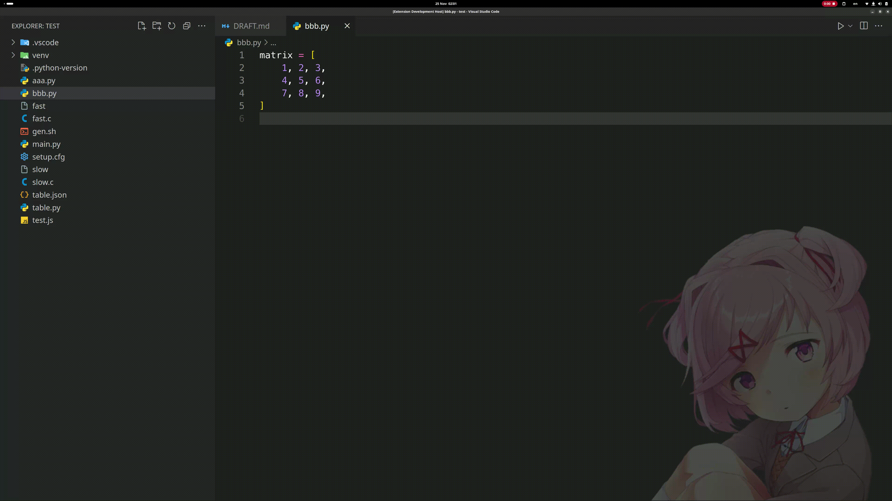

# Markov Editor

> **Markov Editor** is under development and currently lacks some essential features, making it more Turing-tarpit than Turing-complete.

**Markov Editor** is VSCode extension for text manipulations inspired by [Refal](https://en.wikipedia.org/wiki/Refal) and [Markov algorithms](https://en.wikipedia.org/wiki/Markov_algorithm) in general.

It allows you to define a set of rules, each consisting of a regex and a corresponding substitution, which are applied sequentially to the text.
This simple design is surprisingly Turing-complete, enabling solutions to complex tasks

For example, suppose you have described all possible states of a queueing model and want to calculate the number of jobs in the system.

With **Markov Editor**, you can achieve this by defining six simple rules. In future releases, built-in operations will allow this to be done with a single rule.:


Or perhaps you need to reverse the rows of a matrix and wrap them in a list:



## Install

You can install the **Markov Editor** extension from the [VSCode Marketplace](https://marketplace.visualstudio.com/items?itemName=butvinm.markov)

... or via cli:
```bash
code --install-extension butvinm.markov
```

## Attributions

- Uicons by <a href="https://www.flaticon.com/uicons">Flaticon</a>

## Roadmap

- [x] Basic rules and substitutions, enough to solve historically initial idea about jobs number in the queue
- [ ] Rule-sets, calls to the rule sets within substitution
- [ ] 2D rules. Text is a spatial object, and we often think about its transformations not only in terms of rows but also columns.
- [ ] Built-in ops: arithmetic, to lower/upper/title/kebab/snake/camel case, reverse, trim, split, map/reduce
